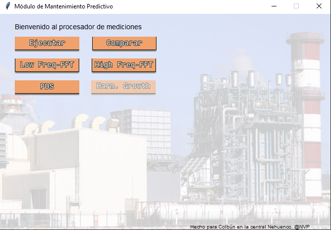
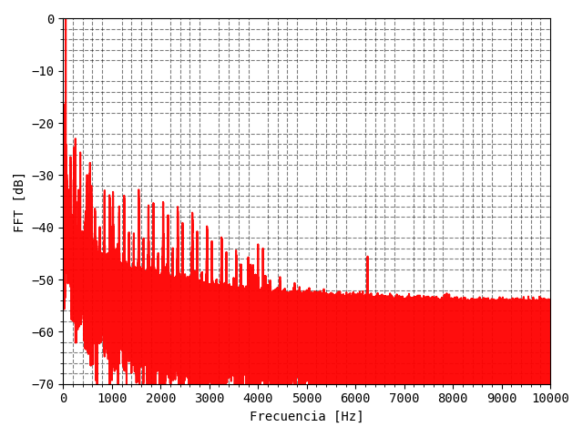
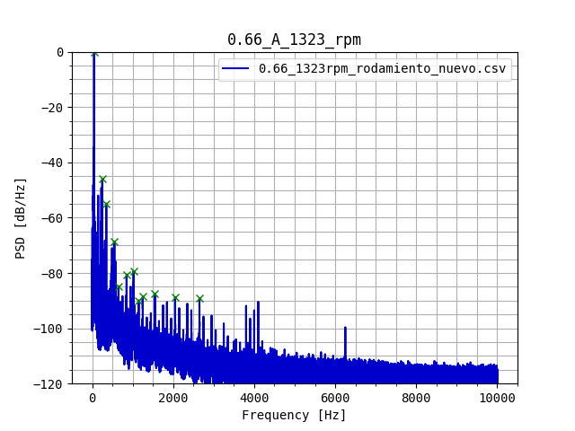
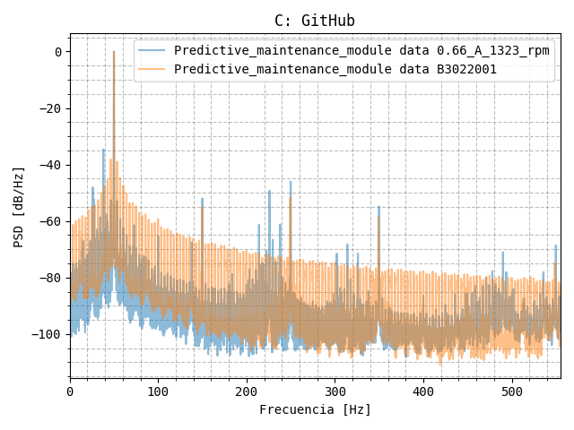

# CLB_fft
Código para integración de mediciones HIOKI PQONE y análisis espectral

Developed around summer 2022 at Nehuenco-Colbún, this project uses a GUI to call python scripts that handles the measurements of the HIOKI PQONE after they are exporten from the vendor's software.
The main purpose was to apply spectral analysis tools to the measurements of stator currents in induction machines.
The scope of application is the detection of common faults.

Diagnosis should (preferably) be done by an electrical engineer capable of interpreting the spectrum of the currents.

Current development is in auto-diagnostic of the following faults:

1. Static and/or dynamic air-gap irregularities.
2. Broken rotor bar or cracked rotor end-rings.
3. Stator faults (opening or shorting of one coil or more of a stator phase winding).
4. Abnormal connection of the stator windings.
5. Bent shaft (akin to dynamic eccentricity) which can result in a rub between the rotor and stator, causing serious damage to stator core and windings.
6. Bearing and gearbox failures

## Preview

### Initial screen

### High frequency fft

### Power spectrum density (PSD)

## Comparar 

